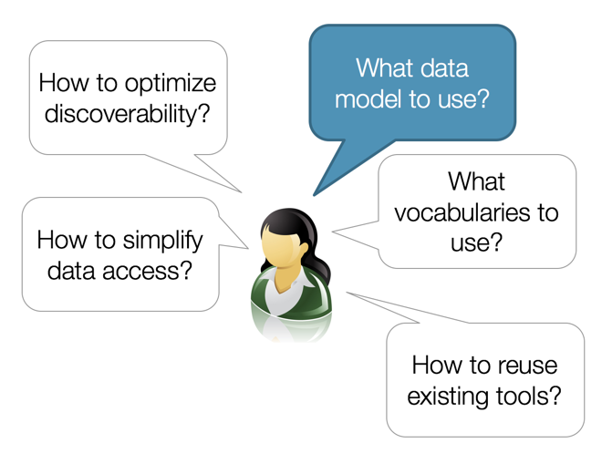
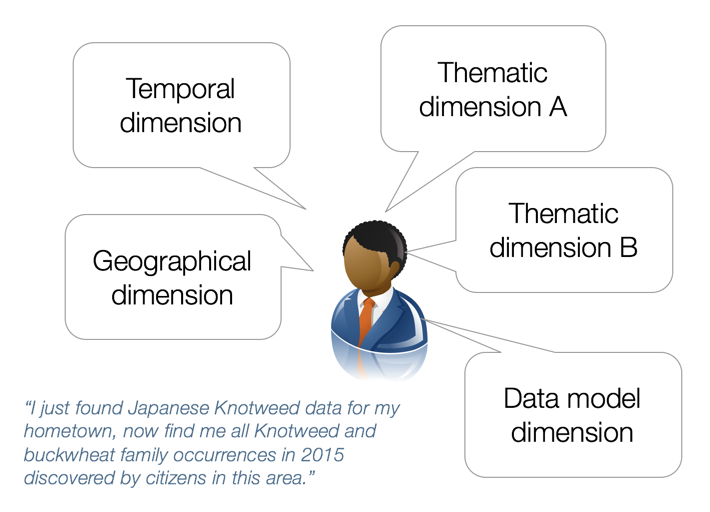
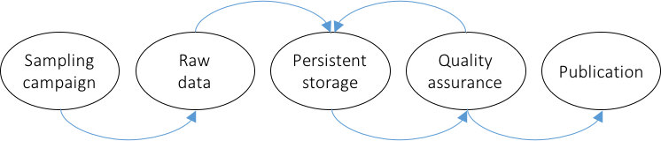
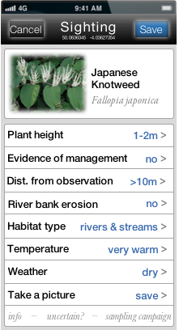

[[CitizenScienceIntroduction]]
== Citizen Science Data Collection and Exchange
Citizen science projects often fail to collect and document their data in standardized forms. Some projects design their own protocols, others use proprietary or disciplinary protocols. This report is based on experiences made in five citizen science projects co-funded by the European Commission. Based on these experiences, the goal was to develop a common model for citizen science data for different sampling campaigns based on existing standards. This engineering report outlines the fundamental structure of such a Citizen Science data profile. It uses existing standards such as OGC Sensor Web Enablement O&M, SensorML, and SweCommon together with TimeseriesML and GML-coverage.

The Citizen Science model developed herein reflects the current status quo in standardization of geospatial data produced in citizen science sampling campaigns. This status quo already allows the definition of a solid and semantically sound model. Nevertheless, interoperability can be further improved. Interoperability contracts and profiles allow to further simplify the sampling campaign definition process and enhance chances for common semantics across campaigns. This report describes the path ahead towards improved interoperability and enhanced ease of use for different citizen science data producers, consumers, survey designers, and quality managers.

Citizen Science data collection and exchange is not a streamlined and consistent process. Depending on the local settings and requirements, a number of aspects need to be decided upon:

* How do data models look like that support reusability of citizen science data even in other than the original context?
* How much information needs to be preserved and documented throughout citizen science data processing chains?
* How can citizen science data be shared efficiently?
* What level of semantics is required to ensure correct usage of citizen science data and how can it be realized?
* What standards need to be considered in order to maximize reusability of citizen science data?
* How can citizen science data be integrated with external data sets?
* How do citizen science data quality assurance processes look like and how can they be documented?
* How can citizen science data be made persistent and accessible (even beyond the lifetime of the original research project)?

These questions reflect the different perspectives of citizen science participants, e.g. data providers, survey designers, or data consumers.

[[img_SurveyDesigner]]
.Particularly relevant aspects for survey designers

<<img_SurveyDesigner,Survey designers>> usually develop their survey design and configure their survey tools and applications based on a set up local requirements. These may require survey data processing steps that include automated processes that require a certain set of metadata and the use of shared vocabularies. In the ideal case, survey designers already consider the future use of the survey data outside of the original context, which adds aspects such as discoverability or simplified access to the data to the list of requirements.

<<img_DataConsumer,Data consumers>> have different motivations and requirements. They are focusing mostly on easy discovery and access, including spatio-temporal and thematic filtering together with easy-to-load data models and encodings.

[[img_DataConsumer]]
.Particularly relevant aspects for data consumers

The goal of the Swe4CS data model was to integrate those different perspectives. In addition, the data model should support specific requirements as formulated as part of the <<CitizenScienceProcess,citizen science data collection, processing, and presentation process>> described below. 

[[CitizenScienceProcess]]
=== The Citizen Science Process
The citizen science process commonly consists of five steps as illustrated in figure  <<img_CitizenScienceProcess,Citizen Science Process>> below. These steps are usually executed sequentially, though include loops and feedback cycles. The first step (left) includes the definition of the sampling campaign itself. The type and nature of the sampling protocol and corresponding observed properties is normally motivated by the survey objectives, but may take additional aspects into consideration such as quality assurance process or publication requirements. Once defined, an (usually) mobile app (survey app) is configured and made available to the citizens to support the data collection process. All raw data, i.e. the observation data as provided by citizens, is persistently stored and eventually published. Quality assurance processes work on the raw data and on previously quality assured data, potentially taking external data sets into account. This multi-loop process may result in any number of data sets of various quality or aggregation levels or any number of versions of raw, quality assured, aggregated, or newly derived data sets.

[[img_CitizenScienceProcess]]
.Citizen Science Process

The end of the citizen science process is the publication of the data, which in turn might be the beginning for another process. The publication can include all levels from raw to highly processed data. In this report, we make primarily use of an exemplary sampling campaign executed as part of the research project https://cobwebproject.eu[Citizen OBservatory WEB (COBWEB)]: The https://en.wikipedia.org/wiki/Fallopia_japonica[Japanese Knotweed] survey.

=== Exemplary Sampling Campaign
Citizen science sampling campaigns often make use of mobile applications to support the citizen in the data collection process. Figure <<img_MobileApp,Japanese Knotweed Sampling Application>> illustrates such a mobile app that is used in Japanese Knotweed (Fallopia japonica) sampling campaigns. Occurrences of the invasive species Japanese Knotweed are monitored in many places of the world. Japanese Knotweed, native to East Asia, is a large, herbaceous perennial plant of the Polygonaceae family. It is known for its invasive root system and strong growth that can damage concrete foundations, buildings, flood defenses, roads, or sidewalks. It can also reduce the capacity of channels in flood defenses to carry water and accelerate river bank erosion (Bailey 2003).

One of the primary goals during sampling campaign definition is to avoid any ambiguities in the understanding of observed properties, used sensing techniques and hardware, and sampling protocols between survey designers and citizens. Both groups shall share common semantics of all terms used. Though the interaction options with a mass of citizens is limited, and little influence exists to ensure that citizens make themselves familiar with the applied semantics, it is crucial that clear instructions and definitions of all aspects, e.g. observed properties or sensors, are available. As the screen space on mobile devices is limited, it is necessary to provide resolvable links to all observed properties and clear explanations of the sampling protocol and applied sensing hardware. The application shown in Figure 2 illustrates this aspect using the observed properties as an example. Though “Plant height” is probably easy to understand, “Evidence of management” leaves considerably more room for interpretation. There are many aspects related to user interface design that cannot discussed here. Instead, focus is laid on the definition of the semantics, which are not visible to the user.

[[img_MobileApp]]
.Japanese Knotweed Sampling Application

If all observed properties would be using definitions in the form of simple names, semantics would be limited to the understanding of the survey designer and, given that sufficient descriptive data are provided as part of the mobile app, to the citizens participating in the survey. If instead fully qualified names in the form of resolvable URLs would be used, then the raw data becomes meaningful even to external users that have not used the mobile app but only received the raw data. Labels can still be used for display purposes.

Other examples and survey types are used if necessary. This report does not cover any software architecture that could be used for fully standards-based data creation and exchange.
