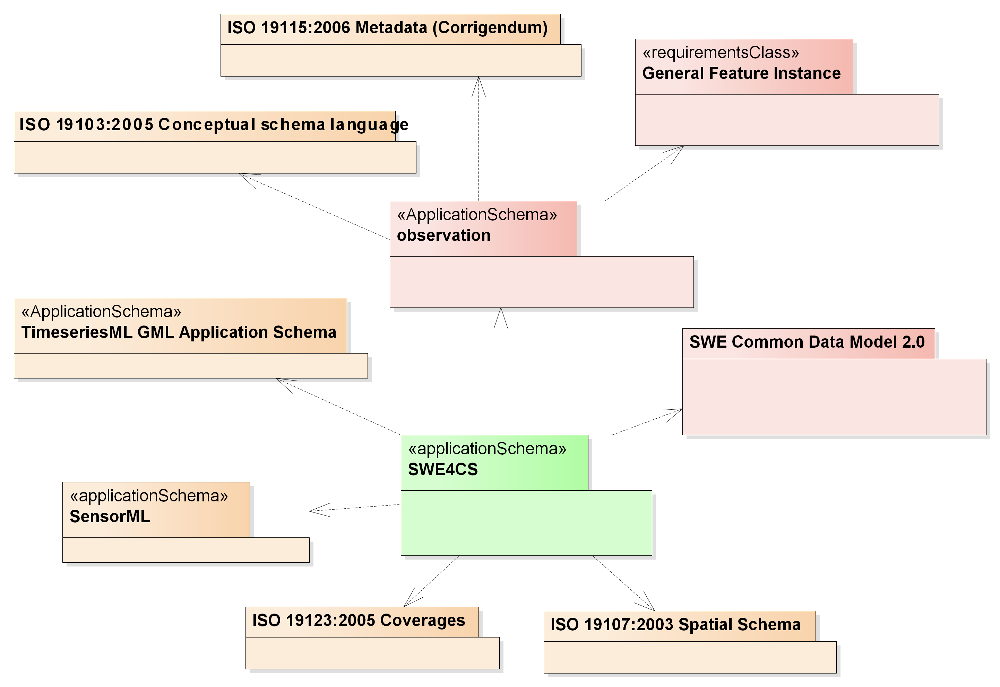
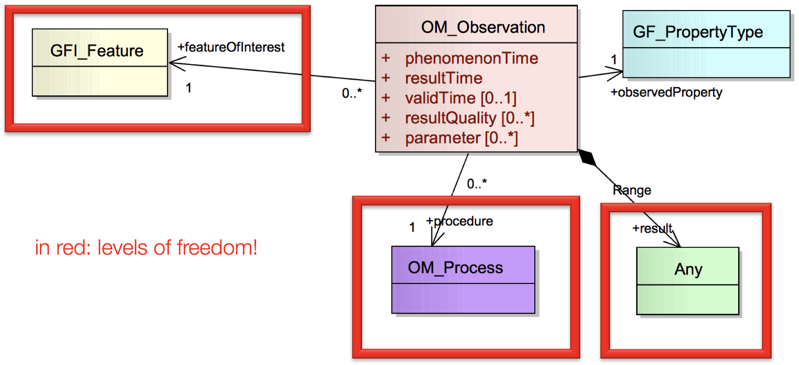
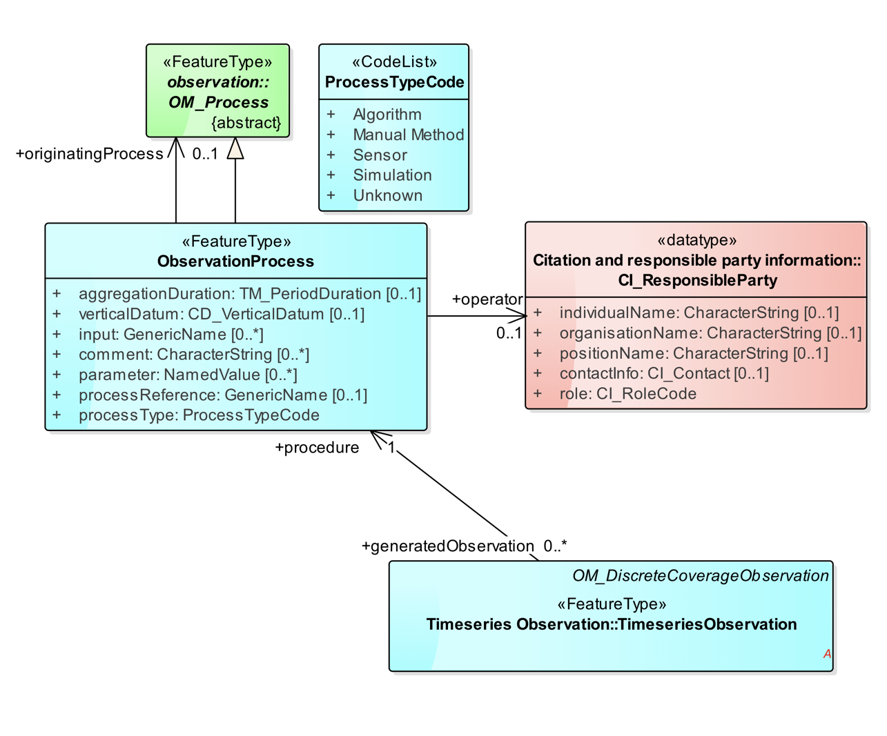
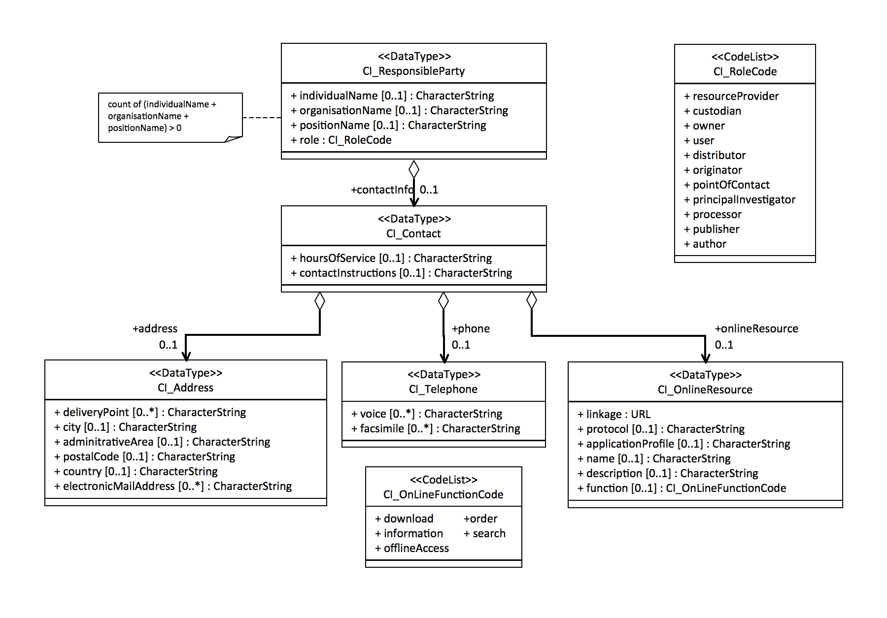

[[CitizenScienceModels]]
== Citizen Science Data Models
_SWE For Citizen Science_ (Swe4cs) is a common data model suitable for collecting and sharing citizen science data. It is based on the ISO 19156 / http://portal.opengeospatial.org/files/?artifact_id=41579[OGC Abstract Specification Topic 20 Observation and Measurements (O&M)] standard and implemented as an http://www.iso.org/iso/catalogue_detail.htm?csnumber=59193[ISO 19109] (Geographic information - Rules for application schema) compliant application schema, which implements key elements from other ISO standards following the conventions defined in http://www.iso.org/iso/home/store/catalogue_tc/catalogue_detail.htm?csnumber=32554[ISO 19136] / http://www.opengeospatial.org/standards/gml[OGC Geography Markup Language (GML)]. Swe4cs is based on the OGC core model, with the General Feature Model (defined in ISO 19109) as a metamodel for representing features in application schemas; therefore, Swe4cs data can easily be processed and integrated with other OGC compliant data such as coverage based on satellite data, sensor data from ground stations, or reference data sets provided by public bodies. In addition, Swe4cs uses standards from the OGC Sensor Web Enablement (SWE) family, a suite of standards initially developed to realize the Sensor Web. Originally designed to network sensors, the scope of SWE has broadened to include humans as sensors and sensor data processing capacities. Swe4cs uses the OGC standards http://www.opengeospatial.org/standards/sensorml[SensorML], a robust and semantically-tied means of defining assets, to describe sensors used in sampling campaigns, and http://www.opengeospatial.org/standards/swecommon[SWECommon], a low-level data model for exchanging sensor related data between nodes of the OGC Sensor Web Enablement (SWE) framework. To express time series and coverage data, Swe4cs implements OGC standards https://portal.opengeospatial.org/files/?artifact_id=64592[TimeseriesML] and https://portal.opengeospatial.org/files/?artifact_id=41438[GML coverages]. The package dependencies are illustrated in the figure <<img_Swe4CSPackageDependencies,below>>.

[[img_Swe4CSPackageDependencies]]
.Package dependencies of the Swe4CS data model

The currently available Swe4cs model has been designed with a focus on reusing existing standards to the greatest degree possible. As it stands, Swe4cs is suitable for expressing the key elements of a citizen science observation, i.e. the observed property(ies), the results, temporal and spatial aspects, potentially used hardware, and information about the volunteer herself. It is envisioned that future interoperability pilots are required to extend the model and address remaining interoperability concerns, including:

* Definition of the sampling protocol
* Semantic pointers to shared ontologies
* Definition of a Swe4cs constraint model of SensorML to overcome design issues caused by the extreme flexibility of SensorML
* Data quality and user feedback
* Further serializations such as JSON and RDF

[[GeneralDesignDecision]]
=== General Design Decision
Defining a data model for a particular community commonly involves a number of design decisions. In the case of Swe4CS, it was decided after long debates to favor a data model that is fully based on existing core standards without profiling them using specializations. The reason is that specializations require adapted client applications to parse serialized data. On the other side, specializations would allow more fine-grained adaptations to particular needs - but these are commonly an issue for interoperability anyway.

[[OMBaseModel]]
=== O&M Base Model
Observation & Measurement (O&M) provides a general model to encode observations done by either humans, machines, or software processes and is therefore suitable for citizen science data. Citizen science data often results from human observations or is provided by citizen scientists using mobile sensor assets. O&M features a number of levels of freedom that require design decisions and constraints in order to result in a model for interoperable data exchange. These levels of freedom are illustrated in figure <<img_OMLevelsOfFreedom,Levels of Freedom in the O&M model>>. The O&M observation model is the core of all citizen science observations. We need to understand a single observation first, before we will look how to aggregate multiple observations in the next chapter. XXX

[[img_OMLevelsOfFreedom]]
.Levels of Freedom in the O&M model

Following the decision to use O&M as is without further specialization, design decisions had to be taken to improve interoperability of the _featureOfInterest_, the _procedure_, and the _result_. Before those are further investigated, the O&M observation properties are briefly discussed.

==== Elements Inherited From GML Super Model
O&M observation inherits a number of elements from it super model GML, the geography markup language which defines an abstract feature as one of its core elements. The _gml:AbstractFeature_ and its type _gml:AbstractFeatureType_ implement the ISO 19109 General Feature Model (we don't discuss the details of the internal structure of the O&M Schema with all its complex types and property types here. O&M_Observation is developed in UML and follows the UML-to-XML Schema rules as defined in ISO 19136. Interested readers are referred to the specifications ISO 19109, 19136, and 19156). Therefore, O&M Observation has a number of properties not directly visible in the <<img_OMLevelsOfFreedom,O&M model>>.

Here, we focus on elements that are relevant for citizen science data only. All three elements are optional:

* (1) *gml:description*: General description of this observation
* (2) *gml:name*: Name of the observation that could be used as a label in a client application
* (3) *gml:boundedBy*: Only relevant for area-observations (e.g. if your are standing on a hill and count all the zebras you can see through your binocular in a 360° turn, you can provide the bounding box of the area you observed) or time series where you walked/cycled/... a certain area or any form of aggregated observation data. The actual location of each observation comes later. XXX

[source,xml]
.XML example: Elements inherited from GML
----
<gml:description>Snowdonia National Park, Japanese Knotweed Survey 2015</gml:description><!--1-->
<gml:name>Japanese Knotweed Observation</gml:name><!--2-->
<gml:boundedBy><!--3-->
    <gml:Envelope srsName="urn:x-ogc:def:crs:EPSG:6.11:4326">
        <gml:lowerCorner>-5.009766 51.266412</gml:lowerCorner>
        <gml:upperCorner>-2.927977 53.127076</gml:upperCorner>
    </gml:Envelope>
</gml:boundedBy>
----

==== phenomenonTime
The _phenomenonTime_ describes the time the _observedProperty_ was observed.

[source,xml]
.XML example: phenomenonTime
----
<om:phenomenonTime>
   <gml:TimeInstant gml:id="t001">
      <gml:timePosition>2015-07-07T10:32:48.460Z</gml:timePosition>
   </gml:TimeInstant>
</om:phenomenonTime>
----

==== resultTime
The _resultTime_ describes the time the result value(s) was assigned to the observation. In most cases, this time is similar to the _phenomenonTime_ defined above. It is different if there is a time gap between the actual observation and the assignment of the result value. This might be the case if a water sample is taken from a river (_phenomenonTime_), analyzed in a lab and the value assigned to that observation once the analysis is completed (_resultTime_).

[source,xml]
.XML example: resultTime
----
<om:resultTime xlink:href="#t001"/>
----

==== validTime, resultQuality, parameter
These three elements may be of little relevance for the original observation, because citizen scientists are often not able to determine how long the observation they did is valid (_validTime_) or the quality of the assigned result value (_resultQuality_). Nevertheless, during the quality assurance processes and control flows citizen science raw data may get annotated with additional information. Then, validity and quality parameters may be set.

The _parameter_ element is a generic extension point that allows adding context specific key-value pairs to observation data without breaking the schema. Clients that cannot make sense of these additional parameters are required to ignore these.

==== procedure
The procedure property of an observation defines the process used to generate the observation. The O&M model uses the empty _OM_Process_ that needs to be further defined in order to achieve interoperability. It is recommended to follow the https://portal.opengeospatial.org/files/?artifact_id=66015&version=2[Timeseries Profile of Observations and Measurements specification (OGC 15-042r3)], which is about to be released to the public soon.

[[img_TSMLProcess]]
.Observation process feature type, source https://portal.opengeospatial.org/files/?artifact_id=66015&version=2[OGC 15-042r3]

_tsml:ObservationProcess_ defines a number of properties that are less relevant in the context of citizen science. At the same time, _tsml:ObservationProcess_ provides the same _parameter:NamedValue_ extension mechanism as _om:Observation_.

We recommend to use the following properties:

* *processType* to define the type of the process. From the _ProcessTypeCode_ code list, the following properties are important:
** *Manual Method* if the observation was performed by a human *without* any additional hardware
** *Sensor* if the observation was performed by a human *with* additional hardware
* *processReference* to link to the sampling protocol. The sampling protocol includes all rules and guidelines on how the sampling should be performed. Currently, there are no models available to define sampling protocols in a standardized way. Instead, sampling protocols are usually provided in text form, often with accompanying images and often enough several pages long.
* *parameter*: the generic extension mechanism should be used to provide information about the sensor(s) being used to generate the observation. In the ideal case, the sensor description is provided using http://www.opengeospatial.org/standards/sensorml[SensorML].
* *operator* to define the citizen scientist who performed the observation. A potential issue here: _operator_ can only be provided once. If more than one person has performed the observation, the data about the additional person(s) needs to be added by alternative ways that require further discussion. The approach used herein  In the case, _parameter_ shall be used to identify the additional persons. Examples are given below for one, two, and anonymous.

The following examples illustrate the _procedures_ definition. Annotations in the examples help understanding the various elements.

[source,xml]
.XML example: procedure; anonymous citizen scientist with cellphone sensors
----
<om:procedure>
  <tsml:ObservationProcess gml:id="op1">
    <!-- processType defines observation performed by human with sensor -->
    <tsml:processType xlink:href="http://www.opengis.net/def/waterml/2.0/processType/Sensor"/>
    <!-- processReference defines sampling protocol -->
    <tsml:processReference xlink:href="https://dyfi.cobwebproject.eu/skos/JapaneseKnotweedSamplingProtocol"/>
    <!-- if a sensor is used, provide the link to the sensor definition here. Use SensorML if possible -->
    <tsml:parameter>
      <om:NamedValue>
        <om:name xlink:href="http://www.opengis.net/def/property/OGC/0/SensorType"/>
        <om:value>http://www.motorola.com/XT1068</om:value>
      </om:NamedValue>
    </tsml:parameter>
    <!-- operator defines the citizen scientist producing this observation -->
    <tsml:operator>
      <!-- anonymous observation producer from ISO 19115, roleCode "Expert" -->
      <gmd:CI_ResponsibleParty>
        <gmd:role>
          <gmd:CI_RoleCode codeList="https://dyfi.cobwebproject.eu/skos#CI_roleCodes" codeListValue="Expert">
          </gmd:CI_RoleCode>
        </gmd:role>
      </gmd:CI_ResponsibleParty>
    </tsml:operator>
  </tsml:ObservationProcess>
</om:procedure>
----

CAUTION: This report shows a number of hyperlinks in the XML examples. Not all of these hyperlinks resolve. Reason is that this report is a discussion paper. No terms have been registered with the http://www.opengeospatial.org/ogcna[OGC Naming Authority] so far. Existing names from the http://def.seegrid.csiro.au/sissvoc/ogc-def/concept[OGC Definitions Service] have been used wherever available. In all other cases, the URLs start with \https://dyfi.cobwebproject.eu.

The following example shows how the citizen scientist can be identified. The ISO 19115 element CI_ResponsibleParty allows providing more detail such as email, phone number etc. as illustrated in figure <<img_CI_ResponsibleParty, below>>.

[[img_CI_ResponsibleParty]]
.CI_ResponsibleParty object describes people and organizations that are related to a resource and their roles

The following XML example illustrates how the _operator_ element of the example above could be modified to provide more details about the citizen scientist who provided the observation.

[source,xml]
.XML example: operator; identified citizen scientist. CI_RoleCode from ISO 19115
----
<tsml:operator>
  <gmd:CI_ResponsibleParty>
    <gmd:individualName>
      <gco:CharacterString>Ingo Simonis</gco:CharacterString>
    </gmd:individualName>
    <gmd:organisationName>
      <gco:CharacterString>OGC</gco:CharacterString>
    </gmd:organisationName>
    <gmd:role>
      <gmd:CI_RoleCode codeList="http://www.isotc211.org/2005/resources/Codelist/gmxCodelists.xml" codeListValue="resourceProvider"/>
    </gmd:role>
  </gmd:CI_ResponsibleParty>
</tsml:operator>
----

==== observedProperty
The property(ies) that is/are of interest in the citizen science sampling campaign. The _observedProperty_ might be a single aspect, such as occurrences of a specific species, e.g. Japanese Knotweed, or a complex of multiple aspects. In all cases, the _observedProperty_'s details can be retrieved from the <<om:result,result>> section described further <<om:result,below>>. Following the link shall lead to a detailed description of the observedProperty. If available, existing vocabularies shall be used.

[source,xml]
.XML example: observedProperty
----
<om:observedProperty xlink:href="https://dyfi.cobwebproject.eu/skos/bogs"/>
----

==== featureOfInterest
The _featureOfInterest_ is a tricky element. Following the rules and guidelines provided in https://portal.opengeospatial.org/files/?artifact_id=22467&version=2[Observations and Measurements – Part 2 - Sampling Features], the _featureOfInterest_ can describe the ultimate feature of interest, called _domain feature_, or a (spatial) sampling feature. Sampling features are used if the ultimate feature of interest only allows observations being made on a subset of the complete feature, with the intention that the sample represents the whole. This is for example the case if we sample Japanese Knotweed in Snowdonia National Park. We cannot assume that we sample the whole national park, but only walk randomly around and spot knotweed here and there. The random walk is a sampling feature, and if the citizen walks around long enough, we can assume that the observations made represent the whole park. In this case, the _featureOfInterest_ is the sampling feature that in this case represents the whole ultimate feature of interest, the domain feature Snowdownia National Park.

If the citizen scientist tracks his path, i.e. can provide the full trajectory, then the _featureOfInterest_ is a _spatial sampling feature_ in the form of a _SF_SamplingCurve_ that reveals all locations of the citizen scientist during his walk in Snowdonia National Park. This is highly valuable information, as it allows estimating the coverage of the sampling campaign and helps understanding if areas without any knotweed occurrences have not been explored or de facto have no knotweed growing. In this case, the _featureOfInterest_ would be defined in more detail: It contains the path itself in the form of a shape definition, and the ultimate feature of interest in the form of the _sampledFeature_.

The following examples illustrate this concept.

[source,xml]
.XML example: featureOfInterest defines a domain feature
----
<om:featureOfInterest xlink:href="https://dyfi.cobwebproject.eu/skos/Snowdonia_National_Park"/>
----

The link to the feature of interest can be a call to a Web Feature Service also.
[source,xml]
.XML example: featureOfInterest defines a domain feature as accessible at a Web Feature Service (WFS) instance
----
<om:featureOfInterest xlink:href="http://example.com/wfs?service=WFS&request=GetFeature&version=2.0.0&featureID=SnowdoniaNationalPark"/>
----

The following example illustrates a survey with existing trajectory data.

[source,xml]
.XML example: featureOfInterest defines a spatial sampling feature (1)  with sampled feature (2) and shape information (3)
----
<om:featureOfInterest>
  <sams:SF_SpatialSamplingFeature gml:id="sf001"><!--1-->
    <sf:type xlink:href="http://www.opengis.net/def/samplingFeatureType/OGC-OM/2.0/SF_SamplingCurve"/>
    <sf:sampledFeature xlink:href="https://dyfi.cobwebproject.eu/skos/Snowdonia_National_Park"/><!--2-->
    <sams:shape><!--3-->
      <gml:Curve gml:id="sc1" srsName="urn:ogc:def:crs:EPSG:6.8:3857">
        <gml:segments>
          <gml:LineStringSegment>
            <gml:posList>52.4096027 -4.0782345 52.4095827 -4.0782352 52.409551 -4.0782377 52.4094811 -4.0782878 52.4095147 -4.0789545 52.409452 -4.0787875 52.409124 -4.0785565 52.4091245 -4.0782447 52.4097877 -4.0782454 52.4097797 -4.0781024</gml:posList>
          </gml:LineStringSegment>
        </gml:segments>
      </gml:Curve>
    </sams:shape>
  </sams:SF_SpatialSamplingFeature>
</om:featureOfInterest>
----

==== result
The _result_ property provides the actual observation result data. _om:result_ points to a generic placeholder _Any_, which has been further specialized in the citizen science profile to _SweCommon_ _DataRecord_ to encode all result data. For a single observation, this is straight forward and illustrated in the XML example below.

[source,xml]
.XML example: result property defining topography type, a photo, and three plant species
----
<om:result>
  <swe:DataRecord>
    <swe:field name="topographyType">
      <swe:Text definition="https://dyfi.cobwebproject.eu/skos/topographyType">
        <swe:value>Mountain</swe:value>
      </swe:Text>
    </swe:field>
    <swe:field name="photo">
      <swe:Text definition="https://dyfi.cobwebproject.eu/skos/photo">
        <swe:value>https://dyfi.cobwebproject.eu/1.3/pcapi/records/local/2338e388-f34e-25d9-945c-54cffd9c46c2/ob (11)/1434891560330.jpg</swe:value>
      </swe:Text>
    </swe:field>
    <swe:field name="plants">
      <swe:DataRecord><!--1-->
        <swe:field name="plant">
          <swe:Text definition="http://rs.tdwg.org/dwc/terms/index.htm#Taxon">
            <swe:value>Bog cotton</swe:value>
          </swe:Text>
        </swe:field>
        <swe:field name="plant">
          <swe:Text definition="http://rs.tdwg.org/dwc/terms/index.htm#Taxon">
            <swe:value>Common rush</swe:value>
          </swe:Text>
        </swe:field>
        <swe:field name="plant">
          <swe:Text definition="http://rs.tdwg.org/dwc/terms/index.htm#Taxon">
            <swe:value>Other</swe:value>
          </swe:Text>
        </swe:field>
      </swe:DataRecord>
    </swe:field>
  </swe:DataRecord>
</om:result>
----

The _DataRecord_ contains any number of fields with semantics coded in the _definition_ attribute. It is recommended to link to common vocabularies to improve reusability. Alternatively, if survey managers set up their own vocabulary as illustrated here, it is recommended to use the http://www.w3.org/2004/02/skos/[SKOS Simple Knowledge Organization System] with links to external, commonly used vocabularies, as availability of the vocabulary can be assured and shared semantics achieved through links to external ontologies.

As illustrated in the example above, _SweCommon_ allows nesting further _DataRecord_s. This allows adding more than one value for a single type, here done with three different plants that have been observed. Instead of (1) _swe:DataRecord_ a _swe:DataArray_ could be used, but it does not add any value here, as the number of entries fixed.
