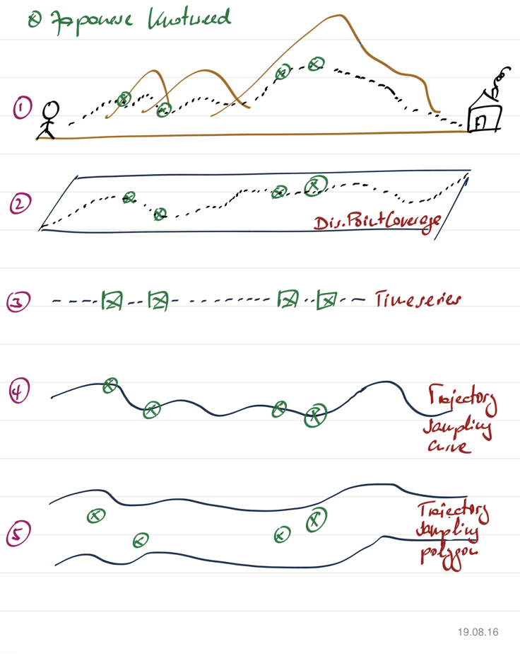

[[CitizenScienceCollections]]
== Observation Collections and Aggregations

The <<CitizenScienceModels,previous chapter>> introduced the citizen science model for simple and complex observations, i.e. individual observations done by citizen scientists. This chapter introduces observation collections and aggregation patterns. These patterns will make use of the citizen science model as described, but extend it to allow different types of aggregations, e.g. all observations by a specific citizen scientist, or all observations in a given area, etc. These collections and aggregations are either produced directly by the (mobile) applications used by citizen scientists to optimize data transfer, or result from data analysis and filtering processes.

The following figure illustrates different aspects that need to be taken into consideration. Here, a citizen scientist walks from left to right and detects four occurrences of Japanese Knotweed (1). These occurrences can be modeled in different ways, depending on the sampling protocol and other potentially available information. One option is _DiscretePointCoverage_ (2). Here, the extent of the coverage describes the projected path of the scientist to the plane. Occurrences of Japanese Knotweed are modeled as _MultiPoint_ elements in a _MultiPointCoverage_. The second option, if the exact path of the scientist is not available or does not matter, is a simple _TimeSeries_. The third option and fourth option illustrated in the <<img_AggregationPatterns, figure below>> provide the trajectory and encode all occurrences together with the sampling path (4), or, if the sampling protocol defines to watch out for occurrences 10m left and right of the path, as a sampling polygon (5).

[[img_AggregationPatterns]]
.Observation aggregation patterns

The following XML examples show the encoding of the various options described above. To improve readability, the number of Japanese Knotweed occurrences has been reduced to two and all elements except for _featureOfInterest_ and _result_ have been omitted.

=== Aggregation encoding: DiscretePointCoverage
The first examples illustrates Japanese Knotweed occurrence encoded as a _DiscretePointCoverage_. This is the recommended approach if a compact serialization is intended and the number of observed properties and corresponding result elements remains stable. 

[source,xml]
.XML example: DiscretePointCoverage option
----
<om:featureOfInterest xlink:href="https://dyfi.cobwebproject.eu/skos/Snowdonia_National_Park"/>
<!-- the result uses a gmlcov:MultiPointCoverage. Each observation occurrence results in a   MultiPoint:member gml:Point as part of the domain set. Values are provided as part of the rangeSet,   which is described in rangeType -->
<om:result>
  <gmlcov:MultiPointCoverage gml:id="c001">
    <gml:domainSet>
      <gml:MultiPoint gml:id="mp0001_C0042" srsName="http://www.opengis.net/def/crs/EPSG/0/4979">
        <gml:pointMember>
          <gml:Point gml:id="sp1">
            <gml:pos srsName="urn:ogc:def:crs:EPSG:6.8:3857">52.409602775074845 -4.078234501964251</gml:pos>
          </gml:Point>
        </gml:pointMember>
        <gml:pointMember>
          <gml:Point gml:id="sp2">
            <gml:pos srsName="urn:ogc:def:crs:EPSG:6.8:3857">53.1139046729 -3.78766989708</gml:pos>
          </gml:Point>
        </gml:pointMember>
      </gml:MultiPoint>
    </gml:domainSet>
    <gml:rangeSet>
      <!-- Note: Order of components within a composite rangeSet value (e.g. tuples in tupleList) corresponds to document order of the rangeType elements (e.g. fields). -->
      <gml:DataBlock>
        <gml:rangeParameters/>
        <gml:tupleList decimal=".">
          "http://www.motorola.com/XT1068","2015-11-03T15:45:41","https://dyfi.cobwebproject.eu/65141986.jpg",1.0
          "http://www.sony.com/D6603","2015-07-07T13:06:48.394Z","https://dyfi.cobwebproject.eu/74370609.jpg",2.0
        </gml:tupleList>
      </gml:DataBlock>
    </gml:rangeSet>
    <gmlcov:rangeType>
      <swe:DataRecord>
        <swe:field name="mobilePhoneType">
          <swe:Text definition="https://dyfi.cobwebproject.eu/skos/mobilePhoneType"/>
        </swe:field>
        <swe:field name="samplingTime">
          <swe:Time definition="http://www.opengis.net/def/property/OGC/0/SamplingTime">
            <swe:label>Sampling Time</swe:label>
            <swe:uom xlink:href="http://www.opengis.net/def/uom/ISO-8601/0/Gregorian"/>
          </swe:Time>
        </swe:field>
        <swe:field name="image">
          <swe:Text definition="https://dyfi.cobwebproject.eu/skos/image" />
        </swe:field>
        <swe:field name="approxPlantHeight">
          <swe:Quantity definition="https://dyfi.cobwebproject.eu/skos/approxPlantHeight">
            <swe:uom code="m"/>
          </swe:Quantity>
        </swe:field>
      </swe:DataRecord>
    </gmlcov:rangeType>
  </gmlcov:MultiPointCoverage>
</om:result>
----

=== Aggregation encoding: Collection of observations
The second examples illustrates Japanese Knotweed occurrence encoded as a collection of individual observations and thus represents a simple form of time series. This option allows to capture different number of elements per observation, e.g. at the first observation lists two species, Sphagnum moss and Bog cotton, where as the next lists Bog cotton, Common rush, and Star moss. Those varying number of observed property results are best serialized using the _swe:DataRecord_ approach.

[source,xml]
.XML example: Collection of individual observations
----
<?xml version="1.0" encoding="UTF-8"?>
<gml:FeatureCollection gml:id="JapanesKnotweedFeatureCollection_1">
  <gml:description>Collection of Japanese Knotweed observations, Dyfie, Wales</gml:description>
  <gml:name>Observation Collection 1</gml:name>
  <gml:featureMember>
    <om:OM_Observation gml:id="_x3ebvgy65">
      <gml:description>Swe4CitizenScience example observation from the Japanese Knotweed field sampling campaign</gml:description>
      <gml:name>Japanese Knotweed Observation, pure OM, TSML and SWECommon</gml:name>
      <om:type xlink:href="http://www.opengis.net/def/observationType/OGC-OM/2.0/OM_ComplexObservation"/>
      <om:phenomenonTime>
        <gml:TimeInstant gml:id="t001">
          <gml:timePosition>2015-11-03T15:45:41</gml:timePosition>
        </gml:TimeInstant>
      </om:phenomenonTime>
      <om:resultTime xlink:href="#t001"/>
      <om:procedure>
        <tsml:ObservationProcess gml:id="op1-moto">
          <!-- processType defines observation performed by human with sensor -->
          <tsml:processType xlink:href="http://www.opengis.net/def/waterml/2.0/processType/Sensor"/>
          <!-- processReference defines sampling protocol -->
          <tsml:processReference xlink:href="https://dyfi.cobwebproject.eu/skos/JapaneseKnotweedSamplingProtocol"/>
          <!-- if a sensor is used, provide the link to the sensor definition here. Ideayll, value points to SensorML definition -->
          <tsml:parameter>
            <om:NamedValue>
              <om:name xlink:href="http://www.opengis.net/def/property/OGC/0/SensorType"/>
              <om:value>http://www.motorola.com/XT1068</om:value>
            </om:NamedValue>
          </tsml:parameter>
          <!-- operator defines the human producing this observation -->
          <tsml:operator>
            <!-- anonymous observation producer from ISO 19115 -->
            <gmd:CI_ResponsibleParty>
              <gmd:role>
                <gmd:CI_RoleCode codeList="http://www.isotc211.org/2005/resources/Codelist/gmxCodelists.xml" codeListValue="resourceProvider"/>
              </gmd:role>
            </gmd:CI_ResponsibleParty>
          </tsml:operator>
        </tsml:ObservationProcess>
      </om:procedure>
      <!-- namedParameter to provide the sampling campaign identifier -->
      <om:parameter>
        <om:NamedValue>
          <om:name xlink:href="https://dyfi.cobwebproject.eu/skos/SamplingCampaignID"/>
          <om:value>SnowdoniaNationalParkJapaneseKnotweedSurvey2015_Cleaned</om:value>
        </om:NamedValue>
      </om:parameter>
      <om:observedProperty xlink:href="https://dyfi.cobwebproject.eu/skos/BogTaxa"/>
      <om:featureOfInterest>
        <sams:SF_SpatialSamplingFeature gml:id="sf001">
          <sf:type xlink:href="http://www.opengis.net/def/samplingFeatureType/OGC-OM/2.0/SF_SamplingPoint"/>
          <sf:sampledFeature xlink:href="https://dyfi.cobwebproject.eu/skos/Snowdonia_National_Park"/>
          <sams:shape>
            <gml:Point gml:id="sp1">
              <gml:pos srsName="urn:ogc:def:crs:EPSG:6.8:3857">52.409602775074845 -4.078234501964251</gml:pos>
            </gml:Point>
          </sams:shape>
        </sams:SF_SpatialSamplingFeature>
      </om:featureOfInterest>
      <om:result>
        <swe:DataRecord>
          <swe:field name="taxon">
            <swe:Text definition="http://rs.tdwg.org/dwc/terms/index.htm#Taxon">
              <swe:value>Sphagnum moss</swe:value>
            </swe:Text>
          </swe:field>
          <swe:field name="taxon">
            <swe:Text definition="http://rs.tdwg.org/dwc/terms/index.htm#Taxon">
              <swe:value>Bog Cotton</swe:value>
            </swe:Text>
          </swe:field>
        </swe:DataRecord>
      </om:result>
    </om:OM_Observation>
  </gml:featureMember>
  <gml:featureMember>
    <om:OM_Observation gml:id="_vz9f5kbbe">
      <om:type xlink:href="http://www.opengis.net/def/observationType/OGC-OM/2.0/OM_ComplexObservation"/>
      <om:phenomenonTime>
        <gml:TimeInstant gml:id="t002">
          <gml:timePosition>2015-11-03T16:06:48.394Z</gml:timePosition>
        </gml:TimeInstant>
      </om:phenomenonTime>
      <om:resultTime xlink:href="#t002"/>
      <!-- procedure links to procedure data from observation above -->
      <om:procedure xlink:href="#op1-moto"/>
      <!-- namedParameter to provide the sampling campaign identifier -->
      <om:parameter>
        <om:NamedValue>
          <om:name xlink:href="https://dyfi.cobwebproject.eu/skos/SamplingCampaignID"/>
          <om:value>SnowdoniaNationalParkJapaneseKnotweedSurvey2015_Cleaned</om:value>
        </om:NamedValue>
      </om:parameter>
      <om:observedProperty xlink:href="https://dyfi.cobwebproject.eu/skos/fallopia_japonica"/>
      <om:featureOfInterest>
        <sams:SF_SpatialSamplingFeature gml:id="sf002">
          <sf:type xlink:href="http://www.opengis.net/def/samplingFeatureType/OGC-OM/2.0/SF_SamplingPoint"/>
          <sf:sampledFeature xlink:href="https://dyfi.cobwebproject.eu/skos/Snowdonia_National_Park"/>
          <sams:shape>
            <gml:Point gml:id="sp2">
              <gml:pos srsName="urn:ogc:def:crs:EPSG:6.8:3857">53.1139046729 -3.78766989708</gml:pos>
            </gml:Point>
          </sams:shape>
        </sams:SF_SpatialSamplingFeature>
      </om:featureOfInterest>
      <om:result>
        <swe:DataRecord>
          <swe:field name="taxon">
            <swe:Text definition="http://rs.tdwg.org/dwc/terms/index.htm#Taxon">
              <swe:value>Bog Cotton</swe:value>
            </swe:Text>
          </swe:field>
          <swe:field name="taxon">
            <swe:Text definition="http://rs.tdwg.org/dwc/terms/index.htm#Taxon">
              <swe:value>Common moss</swe:value>
            </swe:Text>
          </swe:field>
          <swe:field name="taxon">
            <swe:Text definition="http://rs.tdwg.org/dwc/terms/index.htm#Taxon">
              <swe:value>Star moss</swe:value>
            </swe:Text>
          </swe:field>
        </swe:DataRecord>
      </om:result>
    </om:OM_Observation>
  </gml:featureMember>
</gml:FeatureCollection>
----

=== Aggregation encoding: Collection of observations with track information

The third example illustrates combined path and occurrences information. The applied pattern is _SpatialSamplingFeature_ using a _gml:Curve_ for trajectory information. If a corridor instead of the trajectory would be required, a _gml:Polygon_ would be used instead of the _gml:Curve_. If the collection would not aggregate observations by the same citizen scientist using the same sensing device, a _gml:Collection_ would be used that needs to repeat the various data sets. A full example of such a situation is given in annex XXX.

[source,xml]
.XML example: Sampling curve option. Here, the location of the observation is part of the _result_ element
----
<om:OM_Observation gml:id="_x3ebvgy65">
  <gml:description>Collection of Japanese Knotweed observations, Dyfie, Wales</gml:description>
  <gml:name>Observation Collection 2</gml:name>
  <om:type xlink:href="http://www.opengis.net/def/observationType/OGC-OM/2.0/OM_ComplexObservation"/>
  <om:phenomenonTime>
    <gml:TimeInstant gml:id="t001">
      <gml:timePosition>2015-11-03T15:45:41</gml:timePosition>
    </gml:TimeInstant>
  </om:phenomenonTime>
  <om:resultTime xlink:href="#t001"/>
  <om:procedure>
    <tsml:ObservationProcess gml:id="op1-moto">
      <!-- processType defines observation performed by human with sensor -->
      <tsml:processType xlink:href="http://www.opengis.net/def/waterml/2.0/processType/Sensor"/>
      <!-- processReference defines sampling protocol -->
      <tsml:processReference xlink:href="https://dyfi.cobwebproject.eu/skos/JapaneseKnotweedSamplingProtocol"/>
      <!-- if a sensor is used, provide the link to the sensor definition here. Ideayll, value points to SensorML definition -->
      <tsml:parameter>
        <om:NamedValue>
          <om:name xlink:href="http://www.opengis.net/def/property/OGC/0/SensorType"/>
          <om:value>http://www.motorola.com/XT1068</om:value>
        </om:NamedValue>
      </tsml:parameter>
      <!-- operator defines the human producing this observation -->
      <tsml:operator>
        <!-- anonymous observation producer from ISO 19115 -->
        <gmd:CI_ResponsibleParty>
          <gmd:role>
            <gmd:CI_RoleCode codeList="http://www.isotc211.org/2005/resources/Codelist/gmxCodelists.xml" codeListValue="resourceProvider"/>
          </gmd:role>
        </gmd:CI_ResponsibleParty>
      </tsml:operator>
    </tsml:ObservationProcess>
  </om:procedure>
  <!-- namedParameter to provide the sampling campaign identifier -->
  <om:parameter>
    <om:NamedValue>
      <om:name xlink:href="https://dyfi.cobwebproject.eu/skos/SamplingCampaignID"/>
      <om:value>SnowdoniaNationalParkJapaneseKnotweedSurvey2015_Cleaned</om:value>
    </om:NamedValue>
  </om:parameter>
  <om:observedProperty xlink:href="https://dyfi.cobwebproject.eu/skos/fallopia_japonica"/>
  <om:featureOfInterest>
    <sams:SF_SpatialSamplingFeature gml:id="ssf1">
      <sf:type xlink:href="http://www.opengis.net/def/samplingFeatureType/OGC-OM/2.0/SF_SamplingCurve"/>
      <sf:sampledFeature xlink:href="https://dyfi.cobwebproject.eu/skos/Snowdonia_National_Park"/>
      <sams:shape>
        <gml:Curve gml:id="curve1">
          <gml:segments>
            <gml:LineStringSegment>
              <gml:posList srsName="urn:ogc:def:crs:EPSG:6.8:3857">
                52.0409627 -4.0732345
                52.0410527 -4.0742352
                52.0410612 -4.0752377
                52.0411411 -4.0762878
                52.0411547 -4.0779545
                52.0412423 -4.0787875
                52.0413144 -4.0795565
                52.0414145 -4.0802447
                52.0414477 -4.0812454
                52.0414797 -4.0821024
              </gml:posList>
            </gml:LineStringSegment>
          </gml:segments>
        </gml:Curve>
      </sams:shape>
    </sams:SF_SpatialSamplingFeature>
  </om:featureOfInterest>
  <om:result>
    <swe:DataArray>
      <swe:elementCount>
        <swe:Count>
          <swe:value>4</swe:value>
        </swe:Count>
      </swe:elementCount>
      <swe:elementType name="occurrence">
        <swe:DataRecord id="occurrenceRecord">
          <!--1-->
          <swe:field name="lat">
            <swe:Quantity definition="http://sweet.jpl.nasa.gov/2.0/spaceCoordinates.owl#Latitude" axisID="Lat">
              <swe:label>Latitude</swe:label>
              <swe:uom xlink:href="deg"/>
            </swe:Quantity>
          </swe:field>
          <swe:field name="lon">
            <swe:Quantity definition="http://sweet.jpl.nasa.gov/2.0/spaceCoordinates.owl#Longitude" axisID="Lon">
              <swe:label>Longitude</swe:label>
              <swe:uom xlink:href="deg"/>
            </swe:Quantity>
          </swe:field>
          <swe:field name="image">
            <swe:Text definition="https://dyfi.cobwebproject.eu/skos/image"/>
          </swe:field>
          <swe:field name="approxPlantHeight">
            <swe:Quantity definition="https://dyfi.cobwebproject.eu/skos/approxPlantHeight">
              <swe:uom code="m"/>
            </swe:Quantity>
          </swe:field>
        </swe:DataRecord>
      </swe:elementType>
      <swe:encoding>
        <swe:TextEncoding blockSeparator="&#10;" tokenSeparator=" " decimalSeparator="."/>
      </swe:encoding>
      <swe:values>
        52.0411411 -4.0762878 https://dyfi.cobwebproject.eu/5141986.jpg 1.5
        52.0414145 -4.0802447 https://dyfi.cobwebproject.eu/12144d1.jpg 2.0
        52.0414797 -4.0821024 https://dyfi.cobwebproject.eu/65dfe43.jpg 1.0
      </swe:values>
    </swe:DataArray>
  </om:result>
</om:OM_Observation>
----
