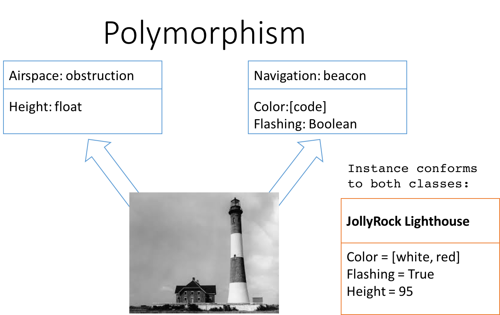
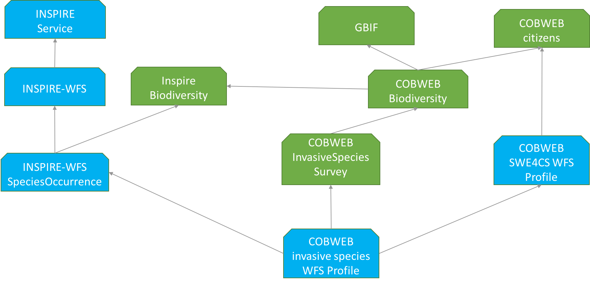
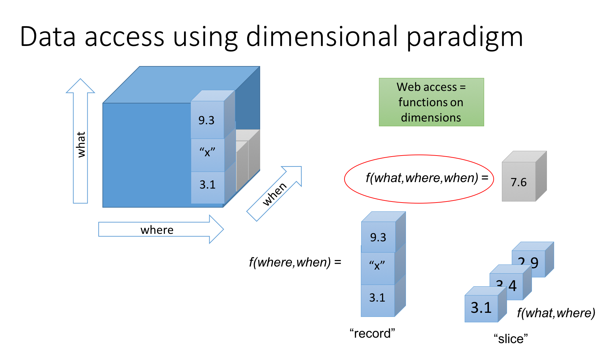
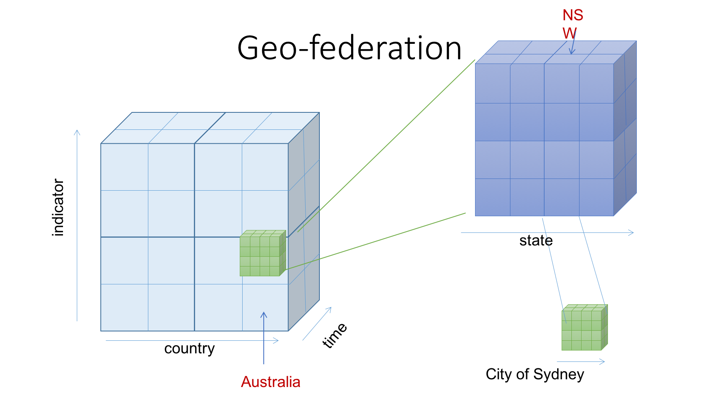
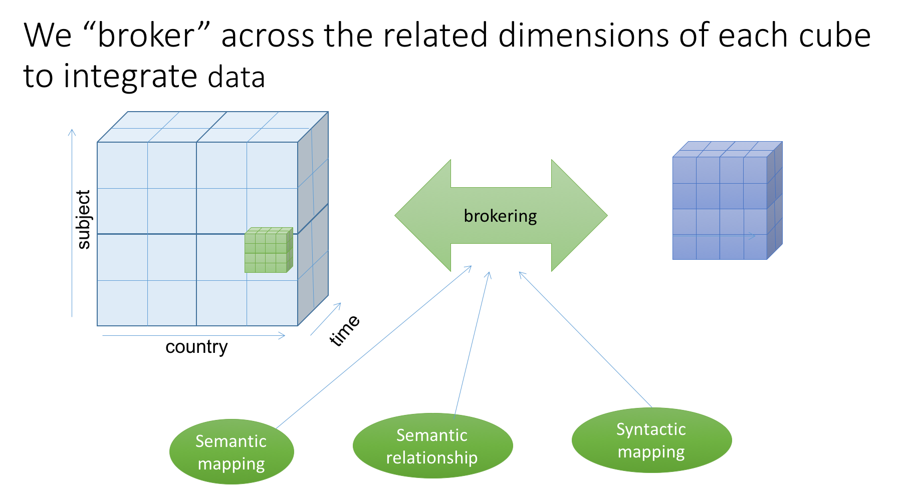
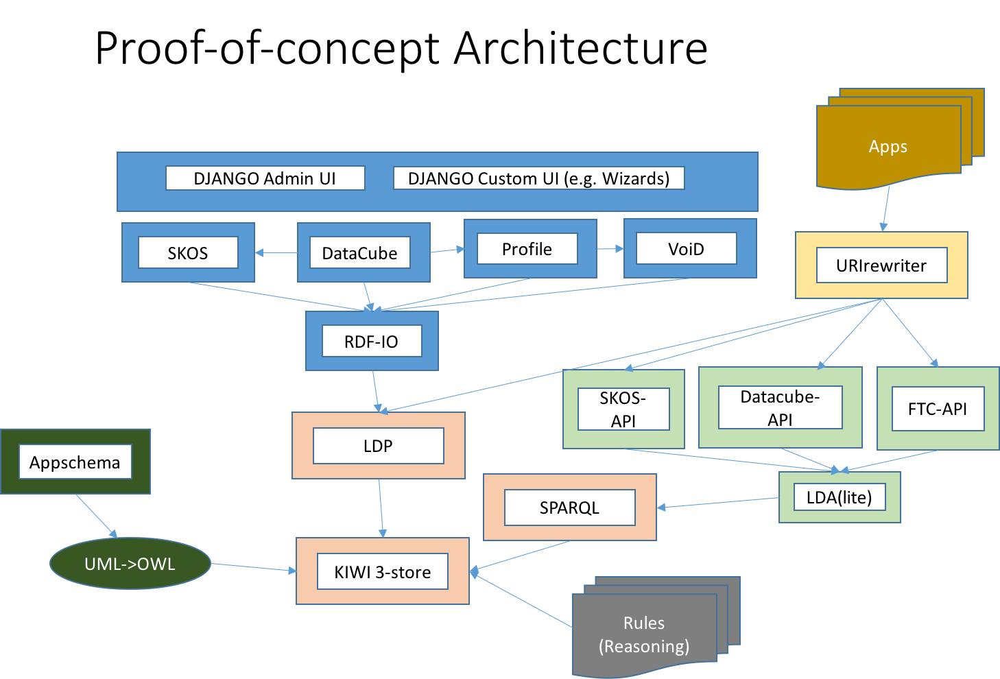

[[EnhancedInteroperability]]
== From Schemas to Data Interoperability Contracts

The use of a known schema, whether it be encoded as XML, JSON or even the classes and properties in an RDF graph, provides for some of the semantics of the data to be understood by the recipient. In general, however, it provides little or no information about a range of key issues that determine if that data can be understood, combined, or even discovered in the context of very large collections. As an example: See the value definition attributes in the <<code_OMResult, SweCommon encoded O&M result model>>, illustrated in the code-snipped <<code_OMResultDefinitions,below>>.

[[code_OMResultDefinitions]]
[source,xml]
.XML example: field definition elements to provide semantics
----
<om:result>
    <swe:field name="topographyType">
      <swe:Text definition="https://dyfi.cobwebproject.eu/skos/topographyType"><!--1-->
        <swe:value>Mountain</swe:value>
      </swe:Text>
    </swe:field>
    <swe:field name="photo">
      <swe:Text definition="https://dyfi.cobwebproject.eu/skos/photo"><!--2-->
        <swe:value>https://dyfi.cobwebproject.eu/cffd560330.jpg</swe:value>
      </swe:Text>
    </swe:field>
    <swe:field name="plant">
      <swe:Text definition="http://rs.tdwg.org/dwc/terms/index.htm#Taxon"><!--3-->
        <swe:value>Bog cotton</swe:value>
      </swe:Text>
    </swe:field name="plant">
</om:result>
----

A client can follow the links to the definitions (1), (2), and (3), but it is unclear what the client will find there. In addition, if the user wants to search for specific topography types (1), the search terms are unknown. Same applies to super-classes, say we want to find all photos (2) and videos. Can we do that? Is (2) a child-class of a super class called _media_ or similar? The same issues arise for survey designers. How can they constrain the range of allowed values? How can the survey designer ensure that whatever term is used fosters for later discovery using super-classes and similar constructs?

Standard practice to date has been the provision of documents defining "Application Profiles" - for example http://www.unidata.ucar.edu/software/netcdf/conventions.html NetCDF]. These profiles, often in combination with additional text documentation, provide the necessary level of detail (or refer to other profiles that they include or are derived from, which makes the process more complicated).

The OGC has been using the ISO 19100 approach to defining Application Schema, using an UML idiom that allows data structures to be defined, but offers no standardized way to allow data providers to further refine the rules about the data content contained. The OGC Modular Specification Policy however supports the inheritance of specifications, and the identification of specification elements (conformance classes and requirements) using URI identifiers.

These processes form a backbone for defining interoperability contracts around data structures and service interfaces. Defining interoperability requirements of data within these constraints needs to be supported by additional mechanisms.

=== Design Goals of Interoperability Contracts

We can summarize the design goals for such mechanisms:

* reduced transaction costs
* improve interoperability between components
* improve ease of use for non-experts
* allow more auto-configuration

==== Reduced Transaction Costs
Implementing interface standards requires development of software. Implementing schema standards requires mapping data structures into the internal data models of consuming systems. These have high transaction costs, borne by the experts building systems, to reduce the transaction cost of users of that software accessing such data.

Interpretation of the data, and semantic translations, remain the problem of the end user, who relies on metadata or prior knowledge of data to discover, formulate appropriate requests, transform and exploit the data. With data descriptions available in large documents, at best, or relatively terse dataset metadata, identify a basis for data integration remains a high transaction cost. Declarative machine readable statements about the conformance of data to one or more interoperability contracts reduce the transaction costs compared to interpretation of unstructured, relatively ad-hoc documents or descriptive metadata.

The goal is therefore to allow data publishers to make statements about data content that can reduce the burden on the end user to discover and exploit data, through both unambiguous identification of conformance with interoperability contracts, and making as much of the aspects of those contracts machine-readable.

==== Improve Interoperability Between Components
It is recognized that similar data may be structured and packaged in many different ways, yet share common elements. For example, a record of _Sea Surface Temperature_ may be held as a gridded coverage over an area, or may be present in discrete samples combined with _Salinity_ readings. A set of readings at different locations may be available for a time period, or the same type of data may be available as a timeseries at a given location.

In the case of Citizen Science activities, it will be important to be able to distinguish different methodologies used to collect the same type of data, including "official data". The requirement is thus to be able to make statements about aspects of the data, and where that aspect is expressed in data encodings. Each aspect will need its own identifier, and be related to the broader data set description as well as further parameters about how that aspect is implemented.

The useful implication is that this will allow partial description of datasets, with key aspects being documented with declarative semantics, whilst allowing less important aspects, or harder to describe, to be documented in an ad-hoc fashion.

==== Improve Ease of Use for Non-Experts
Non experts need explicit statements regarding the semantic compatibility of data for a given purpose, including simple comparability of data. The alternative is locating, accessing, reading and comparing, and ultimately citing, potentially detailed and inconsistently structured descriptive documentation.

The design goal is for interoperability contracts to be constructed of components that can be immediately tested for comparability, using identifiers that can be de-referenced to immediately access relevant sections of documentation.

==== Allow More Auto-Configuration
Data interoperability is enhanced by enforced compliance during data collection, therefore the goal is to provide sufficient guidance to data collection software configuration to automate much of that compliance and user-assistance.

Auto-configuration of data integration processes needs to be supported, partially or wholly, by unambiguous machine-readable metadata of data, preferably carried from the data collection process.
Conformance to structural and semantic contracts then allows auto-configuration of data utilization through re-use of configurations for display or model assimilation.

=== Current Situation in SDIs
It is noted that current Spatial Data Infrastructures based on the _Publish-Find-Bind_ paradigm using catalogues of static metadata records seem to lose performance as the number and heterogeneity of data sets grows. Furthermore, with increased numbers and backgrounds of end-users (such as a broad Citizen Science community) there must be expected a lower level of familiarity of users with the descriptive conventions. Scientists working in a narrow field may be expected to know the code name of a particular instrument (e.g. MODIS Version 6 products to AρρEEARS: MCD43A1, MCD43A3, and MCD43A4 https://lpdaac.usgs.gov/about/news_archive/release_appeears_version_12[as examples]).

We note the following areas where current practices are fragile in multi-stakeholder contexts:

* keywords for discovery
* identification of observed property and methodology
* use of naming conventions in dataset/layer etc names to convey semantic meaning
* data models - identification of , declaration of, descriptions of, relationships between
* consistency of profile and data product specification documents
* discovery of datasets containing information about a particular feature
* lack of easily discoverable links between related data elements

=== Current Situation in "Domain Standards"
Currently "communities of practice" (COP) emerge through various fora and try to address their interoperability requirements. OGC has formalized such a process whereby "Domain Working Groups" can be established, and then work within the OGC framework to generate specifications, which are then vetted for consistency with similar approaches by other domains.

Domains with stakeholders willing and able to take the "long view" may thus standardize data models and service interfaces for interoperability. Applying such standards in the wider community is done by a much broader community, on shorter timescales. Such short term demands mean the payoff for developing standards is hard to realize, and the value of conforming to a given standard/COP requirement must be easily understood and realized.

COPs also emerge out of technical sub-groups from within existing cooperations with the domain. Such groups develop "fit-for-purpose" but idiosyncratic APIs and data models (e.g. GBIF).

Some COPs are created by design, through projects and programs targeting cooperation, such as the GEOSS system, or the COBWEB project. They may be infrastructure oriented, or "network building" attempts. Participation requires conformance to a specification provided by a controlling interest. Typically the aim is that such COP may grow into "opt-in" models embracing a wider audience than the initial participants.

Finally, many COP emerge through common experiences applying common tools to a problem space. User groups for particular toolsets may simply share experiences and resources, and de facto standards emerge.

In the case of complex subject domains, such as Citizen Science, Earth Observation, Urban Design, it is likely that all these models of COP will co-exist. What is missing however is a well-known means for each COP to share its particular concerns in ways which can be combined, compared or even discovered.

=== Improving the Status Quo

We must recognize that effective COP and standards are not going to "go away" - and that leveraging multiple heterogenous approaches has advantages for both legacy system integration, and flexibility to optimize future system design.

Secondly, we must recognize that for each system (or COP) some aspects will be unique but many will be common between COPs. Thus, _granularity_ of requirements specification must be a driving principle. In fact, this is the main shortcoming of the status quo for both SDIs and standards development.

Thirdly, recognizing that the same data can be packaged, transferred and accessed using different technologies, but still conform to an underlying semantics suggests that technical standards need to be applied to data standards, rather than the converse - where each technical standard (schema or interface) needs multiple independent specifications of the data content.

At this point we can note that the trend to separating the "conceptual model" from schema encodings in the OGC standards process is addressing this concern. In addition there is an emerging supporting infrastructure of the OGC Modular Specifications Policy - and publishing components of specifications (conformance classes and requirements) as individual Web-addressable components.

If we then examine, for example, the use of SWE schemas for Citizen Science, we can see that the OGC process works well to a point, at which we start to need to tie data specifications into specific schema elements, and we find ourselves with multiple possible schemas, and no standard way to define the commonality of data elements between these.

The question then is whether an approach to defining data-centric requirements can be "bound" to multiple alternative technical standards, working in a lightweight process suitable for the data design lifecycle, not the software and technical standards lifecycles.

=== Making Data Specifications Easier (More Scalable)
There are many factors to consider when defining how to create data, or describing created data, in sufficient depth to allow integration and appropriate reuse to be achieved. Data product specifications tend to be long complex documents. Reviewing and agreeing on such complex artefacts takes a lot of expertise and time.

However there are several possible approaches to addressing this challenge through simplification:

1. break the problem into discrete components rather than treating it as a monolithic whole.
2. focus on the most important small subset of the problem first, and make sure the approach allows incremental refinement
3. encapsulate different parts of the problem so relevant experts can address specific parts
4. use existing specification components to simplify task of creating new, similar ones - as classes, baselines to refine or templates
5. provide an effective library of reusable components
6. provide effective tooling to assist users with domain expertise to re-use components designed by others with specific technical expertise
7. provide a streamlined governance process for sharing specification components
8. provide methodology and tutorial resources to assist different stakeholders

For scientific data, there are typical elements that can be easily identified that need detailed specification:

1. spatio-temporal values observed
2. spatio-temporal sampling regime (range and granularity of regular samples in space and/or time)
3. provenance
4. data model and how its mapped into one or more data structures
5. terminology used and the definitions
6. procedures and validation (descriptive methodology)

Approaches such as SWE and netCDF provide options for how common data structures may be defined. SWE also binds common approaches to low-level expression (syntax) of spatial datatypes.

The semantics of spatial data instances is handled by defining application schema (i.e. is a point representative of a localized feature, and indicative label point, a centroid, or a reference point; is a polygon a determined or measured boundary). This has two problems:

* different communities will define similar semantics using different terms
* the semantics of the spatial component is now bundled into a much bigger problem of defining the data structure for the whole dataset

Correct and compatible use of terminology, another data value concern, suffers the same problems - without a standardized way to share and declare such terminology each community develops ad-hoc approaches to managing terminology and specifying where and how it is used.

Thus, the next step would appear to be focussing on a simple way of re-using low-level specifications of what various data elements mean, what they are called, and what allowable terms are. If these elements can be combined into a machine-readable component of data specifications (and hence data metadata) then many of the problems of "how do I use this standard data structure for my specific problem" can be addressed by tools that allow such specifications to be declared and shared.

=== Making Data Semantically Richer
In addition to making it easier for data designers, collectors and aggregators, tying data to a more granular set of specifications offers advantages to users. Knowing all the different ways a dataset conforms to a hierarchy of specifications (i.e. the inheritance pattern in the OGC modular specification) makes it possible to use pre-existing knowledge about the more general specifications.

This pattern of behaviors is well known from object-oriented programming, where multiple inheritance (or "polymorphism") is used to declare what a given object supports.

Take for example the example of a lighthouse - which may be both a navigation beacon and an airspace obstruction:
[[img_Polymorphism]]
.Polymorphism - being different things to different users

Similarly, a survey of threatened species in a local context may be part of a larger survey, but also conform to EU standards and the _Global Biodiversity Information Facility_ (GBIF) requirements for a biota occurrence observation.

If survey designers can determine the set of things that the survey data should be compatible with, then multiple inheritance of requirements can be used to create a suite of requirements for the survey, but critically the survey can then be tagged as compliant with each of those inherited requirements.

This multiple inheritance cannot often be applied to data structures (schema) - but it can be applied to the data semantics. Thus we can envisage a pattern where data semantics profiles of common conceptual models can be combined, then applied to a target schema in a final step to define how the data is actually structured.

[[img_Profiles]]
.Profiles inheriting semantics, schema or service interoperability requirements

=== "Data Cube" Approach
The problem of defining data meaning is well known in the broader statistics community, and we can borrow from that experience. The https://www.w3.org/2015/spatial/wiki/Main_Page[Spatial Data on the Web Working Group] is currently exploring definition of spatial concerns using the https://www.w3.org/TR/vocab-data-cube/[W3C's RDF Datacube recommendation].

The _Datacube_ approach is to break the idea of a data structure down,  and recognize two key components that can potentially be machine-interpreted: "Measures" and "Dimensions". This information extends the options of defining the data schema, and its general extents, into far more specific metadata about the semantics of the data itself. In the case of RDF data, RDF-QB defines the semantics of data properties found in the data itself. Applying the same meta-model of a datacube to other data encodings (such as XML, JSON or gridded coverages) will require additional information to identify the structural elements such descriptions apply to. The opportunity here is a data model that exists in a published standard, and the absence of competing equivalent approaches for non-RDF encodings. Using RDF to describe metadata for such data provides an elegant, extensible solution, with suitable components pre-defined.

A _Measure_ is a value recorded in the data - either as a result or as metadata - such as the time something happened, the weight of coffee in a sack, the number of cups sold per shop. Things we need to know about Measures are what is being measured, the datatype used, the unit of measure, precision or resolution, any reference system (such as the WGS84 coordinate system used in GPS measures), and the procedures.

Measures and Observations from the SWE world are obviously closely related.

A _Dimension_ is a more complicated concept - but one critical to an understanding of both data semantics and structure. Dimensions are values for phenomena that may be used to identify a particular set of measures - they are the way data is organized. For example, if a dataset is defined to have measures for something every year, then the values of year are fixed to a value which can be known in advance, and hence its possible to ask for "coffees sold in 2016".  In this example, we can see that the set of coffee shops may be a dimension - hence we can ask for "coffees sold in Shop1 in 2016", or a "slice" - "coffees sold per shop in 2016", "coffees sold per year in Shop1".

[[img_Dimensions]]
.Dimensions and data access methods

Note that a value of the same phenomena may be either pre-defined or measured. Dimensions, representing additional semantic knowledge about the regularity of values, are critical to understanding whether data can be aggregated or disaggregated (accessing finer detail) automatically. Sharing common descriptions of phenomena across dimension descriptions (typically in dataset metadata) and low-level observations (per record) allows the potential relationships between details and summarized to be captured and used to discover and automate.

Nesting of datacubes may be done virtually, using "brokering" to handle the relationships between similar terms used in comparable dimensions. A broker therefore has a set of small, discrete and testable semantic relationships to negotiate, rather than a potentially impossible task of dealing with vaguer descriptions of semantic content.

[[img_Geofederation]]
.Geofederation - a typical "virtual nesting" of datacubes

[[img_Brokering]]
.Semantics enabled brokering of datasets using dimension relationships

There are some  common interoperability dimensions for any observational data:

* geography (feature or grids) (locations may be Measures!)
* observation time
* observedProperty
* observer
* observationProcedure
* data model (result type)

Each of these will typically be present, and be fairly complex to properly or usefully describe, yet each domain will have its own requirements. Thus, the choices are:

1. no standardization - leaving each project to develop and document its own approach (the status quo)
2. a standard data model, and each project describes its usage within this model.
3. an inheritance hierarchy of specialized descriptions

Each of these puts a fair burden on both data providers and consumers. The third option however offers simplicity through encapsulation - or in other words experts can fully describe the baseline (inherited) descriptions and users can make simpler statements about specific cases. End users (consumers) gain the benefit of explicit statements about interoperability with inherited baselines.

Inheritance requires infrastructure support however:

1. a defined mechanism (aka an ontology) describing inheritance and refinement relationships. This may exploit existing ontologies such as OWL - or may require specific semantics)
2. an approach to publishing and sharing descriptions (i.e. a registry - possible federated)
3. tools to perform inheritance reasoning - such as a convenience API on such a registry

=== Standardizing Interoperability Profiles
Following from the above discussion it is now possible to conceive of interoperability specifications as a combination of documents and machine-readable profiles, where profiles detail the structure of the data in terms of standardized dimension descriptions, the meaning of result values and metadata in terms of standardized measures, and the meaning of actual terminology used through interoperable terminology references.

Tooling will be required to manage such complex structures, however the relative similarity of the components suggest that this is is feasible. Structured content management is well supported by available technologies, whereas interpretation of free textual descriptions is an unlikely prospect.

A demonstrator is being developed using the popular _Django Content Management System_ integrated with available semantic and Linked Data tools. [yellow_background]#Link to be inserted here..#

[[img_POC_architecture]]
.Proof-of-concept - a modular register of interoperability specification components using the Django CMS and Linked Data technologies.

=== Terminology Interoperability
Currently standardization of terminology is a typical concern of any community of practice, but there is no supporting mechanism for standardizing the way it is published, accessed and shared. Groups such as the _Marine Metadata Initiative_ have highlighted that such infrastructure is a necessary component of a future architecture. GML supports dictionaries. Many groups such as GBIF, INSPIRE publish terminology via ad-hoc services.

The RDF-QB implementation of the Datacube concept exploits another potential standard: SKOS - however SKOS is a data model and does not specify access methods for distributed resources. Activities such as http://www.sissvoc.info[SISSVoc] define an API for accessing SKOS resources, however it has many more features than perhaps needed and has no formal standard status.

Again, there are many possible choices for handling the heterogeneity of terminology resources:

1. leave it to the user (the status quo)
2. Develop a standardized approach and promote its adoption by data publishers
3. Develop software capable of bridging across all the possible means of publishing vocabularies
4. Have COP develop brokering solutions to standardize access for its own community.

It is difficult to imagine widespread adoption of a standard overnight, however a COP such as SWE4CS, working within the framework of OGC and W3C liaison could potentially demonstrate the value of such an approach. This implies that #4 is a necessary precursor to a standardized approach.

A COP can therefore take on a mixed model:

1. publishing using a "candidate standard" its own managed terminology
2. re-publish terms managed by others, needed by the community, but not directly accessible
3. build software to "wrap" online, but non-standardized terminology resources
4. promote development of standards by publishing its Use Cases etc. in appropriate fora

=== Future SDI Situation
A future Spatial Data Infrastructure leveraging such an approach would allow typical catalog searches to be complemented with a much more powerful view of how datasets are related and structured.

Specifically, the notion of "service endpoints" can be updated to include specifications of how the dimensions of the data set relate to service parameters, to allow such services to be invoked using that semantic knowledge.

* read RDF QB dimensions to understand what vocabularies to query
* query catalog to get the URI template structures for a given vocabulary (or linked data entries?)
* interact with vocabulary to get relationships of query terms and other resources
* data access with content negotiation

=== Next Steps
These recommendations cover many of the aspects of the current unsatisfactory approach to data publishing, however they leverage many existing standards components not familiar to the wider community, and will require additional elements and guidances to be developed and tested.
There is enough to start making the most important aspects interoperable, using particularly the SKOS and Datacube standards as sub-components of an extended metadata architecture. Experimentation is required on how to best manage and combine these elements, and the potential for exploitation in different parts of the data supply chain.

These approaches can be applied immediately to improve the consistency and support stakeholders using off-the-shelf data models and service interfaces such as the SWE standards suite.
Semantic interoperability profiles can however be applied to any data structures and service interfaces, including specialized approaches (such as timeseries coverages), streaming data - and future suites of technical standards.
